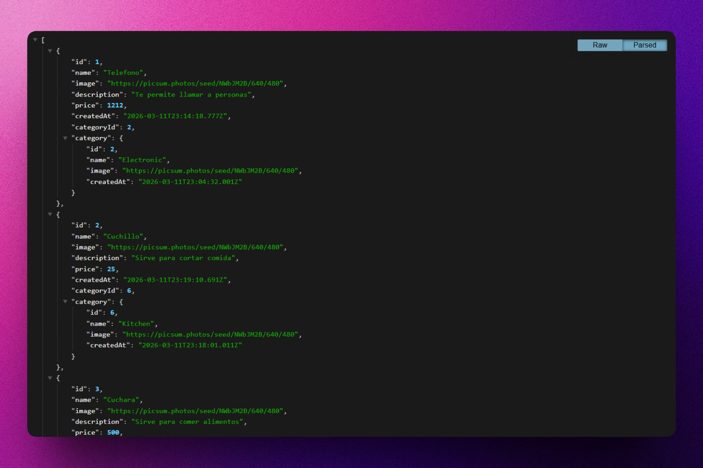

<div align='center'>

# 💽 NODE/POSTGRES: Store API

</div>

### API para gestionar productos de una tienda.

> 🧩 Aquí puedes ver su [**Live Demo.**](https://simple-store-api-abrahamgalue.vercel.app/api/v1/products)



## 🚀 Descripción

Este proyecto es el resultado de un curso completo de Node.js con enfoque en bases de datos relacionales. Se trata de una API que permite gestionar el inventario de productos para una tienda virtual, utilizando **PostgreSQL** como motor de base de dato con la posibilidad de remplazarlo por **MySQL**, gestionados a través de **Sequelize**.

## ⚡ Comenzar

### Prerrequisitos

1. Git.
2. Node.js: cualquier versión a partir de la 20 o superior.
3. pnpm (recomendado).
4. Docker Desktop (para la base de datos).

## 🔧 Instalación y Configuración

### 1. Preparar el entorno

Crea los archivos de variables de entorno necesarios basándote en los ejemplos:

- Copia `.env.example` a `.env` y configura tus variables locales.
- Asegúrate de tener listos `postgres.env` y `MySQL.env` para la configuración de Docker.

### 2. Levantar la Base de Datos (Docker)

El proyecto incluye un entorno de Docker para facilitar el uso de bases de datos y herramientas gráficas de gestión.

```bash
docker-compose up -d
```

Esto levantará los siguientes servicios:

- **PostgreSQL**: Puerto `5432`
- **pgAdmin**: Interfaz gráfica para Postgres en `http://localhost:5050`
- **MySQL**: Puerto `3306`
- **phpMyAdmin**: Interfaz gráfica para MySQL en `http://localhost:8080`

### 3. Instalar dependencias

```bash
pnpm install
```

### 4. Ejecución local (modo desarrollo)

```bash
pnpm run dev
```

Esto iniciará el servidor de desarrollo utilizando `tsx` y tu aplicación estará disponible en `http://localhost:3000`.

## 🎭 Tecnologías

El proyecto utiliza las siguientes tecnologías:

- [**Express**](https://expressjs.com/) como framework de Node.js.
- [**TypeScript**](https://www.typescriptlang.org/) para el desarrollo con tipado estático.
- [**PostgreSQL**](https://www.postgresql.org/) y [**MySQL**](https://www.mysql.com/) como bases de datos.
- [**Sequelize**](https://sequelize.org/) como ORM para la gestión de datos.
- [**Docker**](https://www.docker.com/) para la orquestación de servicios y contenedores.
- [**pgAdmin**](https://www.pgadmin.org/) y [**phpMyAdmin**](https://www.phpmyadmin.net/) como entornos gráficos de bases de datos.
- [**Faker JS**](https://fakerjs.dev/) para generar datos aleatorios.
- [**Joi**](https://joi.dev/) para la validación de esquemas de datos.
- [**Boom**](https://hapi.dev/module/boom/) para el manejo de errores HTTP.
- [**CORS**](https://github.com/expressjs/cors) para gestionar el acceso desde diferentes dominios.
- [**Vercel**](https://vercel.com/home) para el despliegue de la aplicación.
